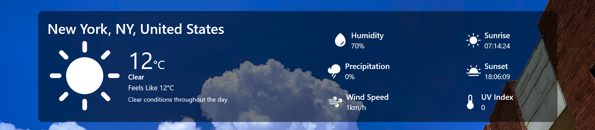

# WeaWhere - Weather info for everywhere

## How it works

Search for the city you want to see the weather in, and just click the button to get instant weather information.

## Get the current weather info!

Get all the relevant weather information about the city you searched for. Everything from the
current temperature and what it feels like to humidity, wind speed, and even sunrise and sunset times because
everyone needs to look at a sunset atleast once a day.

## Weather info for the whole week

Want to go on a run of bike ride in two days but you are not sure how the weather will be? No worries,
WeaWhere provides relevant weather information for the whole week. Just find the day you would like to know the weather for and
see if it will be perfect for a bike ride or a cozy blanket and hot cup of coffee.

# Features

## Error handling

Provides error handling for incorrect city nammes or invalid input. 

## Other features

- Change between Celcius and Fahrenheit with the click of a button
- Fully responsive, works on any device size
- Loading animation while the relevant weather information is being fetched

# Built with 

- Reactjs
- TailwindCSS
- Vite